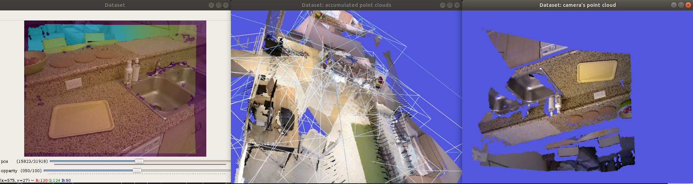

# Fusion Toolbox

A toolkit for prototyping RGBD-based simultaneous localization and
mapping (SLAM) algorithms with PyTorch.

The aim of this project is to faciliciate load, process, visualization
and evaluation of 3D reconstruction pipelines. We also offer
registration algorithm and fusion of surfels using index map.

This work is sponsered by Eldorado Research Institute.

## Features

* [Dataset parsing](doc/samples/Data.ipynb)
* [Visualization](doc/samples/Visualization.ipynb)

* [Processing](doc/samples/Processing.ipynb)
* [Data structures](doc/samples/Data Structures.ipynb)
* [Registration](doc/samples/Registration.ipynb)
* [Surfel fusion]()
* [Evaluation]()

